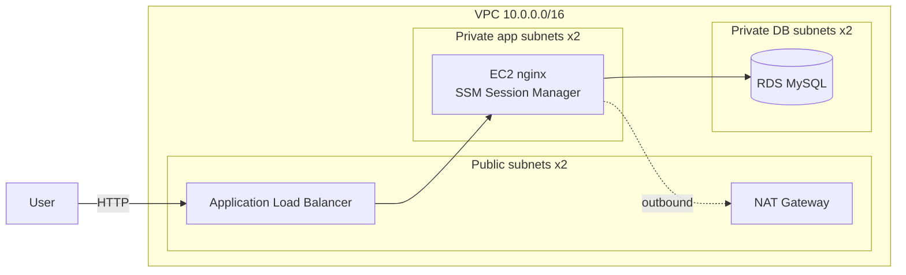

# aws-3tier-web

[](https://github.com/gnk-satou/aws-3tier-web/actions/workflows/ci.yml)


Terraform で AWS 上に 3 層 Web 構成(ALB → EC2 → RDS)を**段階的に**構築するポートフォリオです。
常時稼働はコストがかかるため、**apply → 動作確認 → 証跡スクリーンショット → destroy** の運用で開発しています(証跡は [docs/evidence/](docs/evidence/) 参照)。

## アーキテクチャ(最終形)



## 構築ステップ

| Step | 内容 | 状態 |
|------|------|------|
| 1 | VPC + パブリックサブネット + EC2(nginx, SSM 接続) | ✅ [証跡](docs/evidence/step1/) |
| 2 | ALB を追加し、EC2 への HTTP を ALB 経由に限定 | ✅ [証跡](docs/evidence/step2/) |
| 3 | プライベートサブネット + NAT + RDS、EC2 をプライベート化 | 🚧 |

## 設計方針

- **SSH レス**: EC2 への接続は SSM Session Manager のみ(鍵管理なし、ポート 22 閉鎖)
- **HTTP のみ(暫定)**: HTTPS 化はカスタムドメイン取得後に実施([ADR 0005](docs/adr/0005-http-only-until-custom-domain.md))
- **IMDSv2 強制・EBS 暗号化** をデフォルトで適用
- **コスト管理**: 検証時のみ apply し、確認後 destroy(常時稼働だと月約 $80)
- 設計判断は ADR として [docs/adr/](docs/adr/) に記録

## 開発フロー

- Issue → ブランチ → PR → セルフマージ
- [Conventional Commits](https://www.conventionalcommits.org/ja/)(`feat:` `fix:` `docs:` `chore:` など)
- CI(GitHub Actions): `terraform fmt -check` / `terraform validate` / `tflint`

## 使い方

```bash
cd terraform
terraform init
terraform plan
terraform apply

# 動作確認(Step 2)
# ブラウザで http://<alb_dns_name>/ を開く(直 IP アクセスは SG で遮断される)
# SSM 接続: aws ssm start-session --target <web_instance_id>

# 確認が終わったら必ず破棄
terraform destroy
```

前提: Terraform >= 1.7 / AWS CLI 設定済み / リージョン ap-northeast-1

## ディレクトリ構成

```
.
├── terraform/          # Terraform 本体
├── docs/
│   ├── adr/            # Architecture Decision Records
│   └── evidence/       # 動作確認スクリーンショット(Step ごと)
└── .github/workflows/  # CI 定義
```
